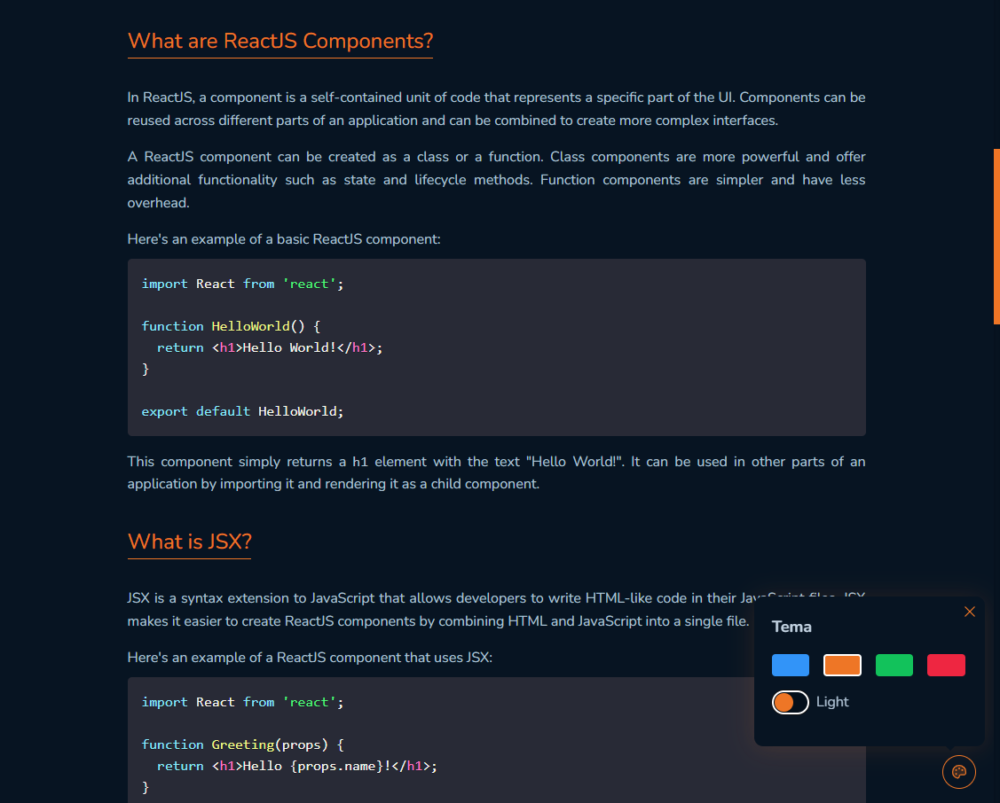

# Githublog

Blog built with ReactJS using Vite and pnpm. This blog was built using of Github API to render the user, and the post content. This works by consuming the [REST API](https://docs.github.com/pt/rest?apiVersion=2022-11-28)

## Status

Finished 🚀

## Preview

## Stack

React
React-Hook-Form
React-Markdown
React-Syntax-Highlight
styled-components
dayjs
jotai
@tanstack/react-query
@radix-ui (Popover, Radio, Switch)
@phosphor-icons

## Contributors

